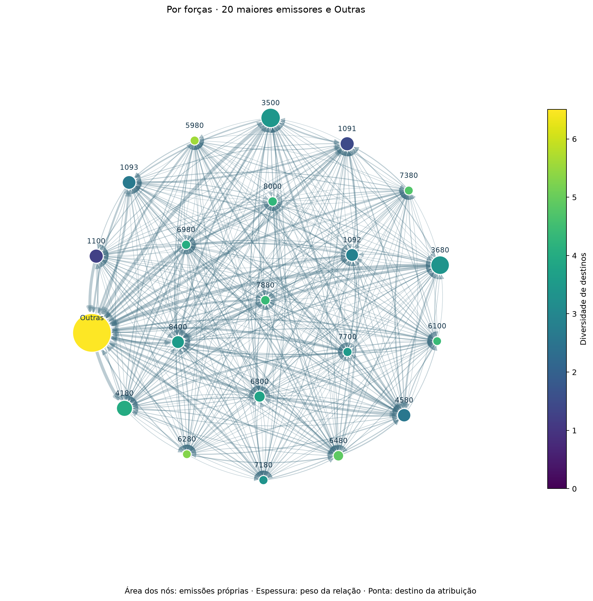
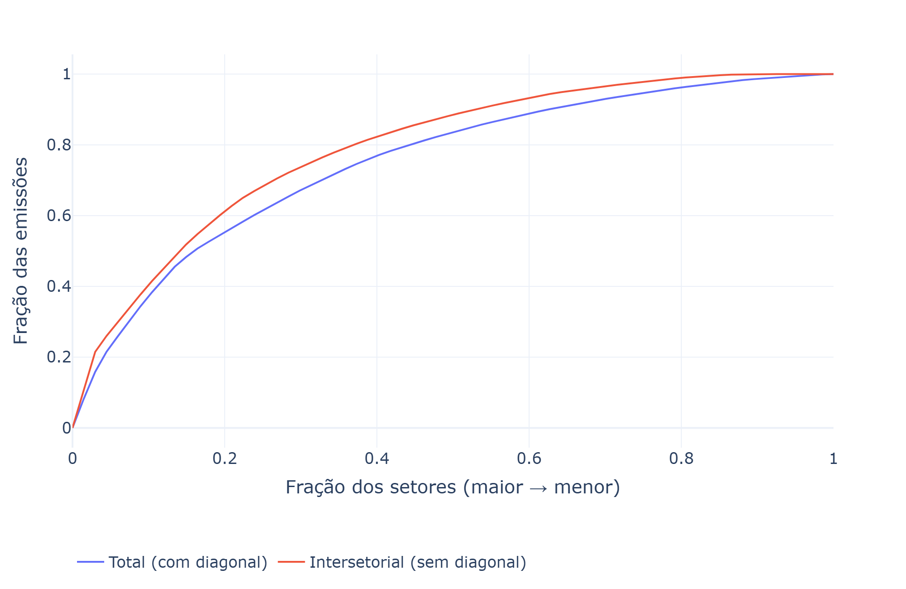
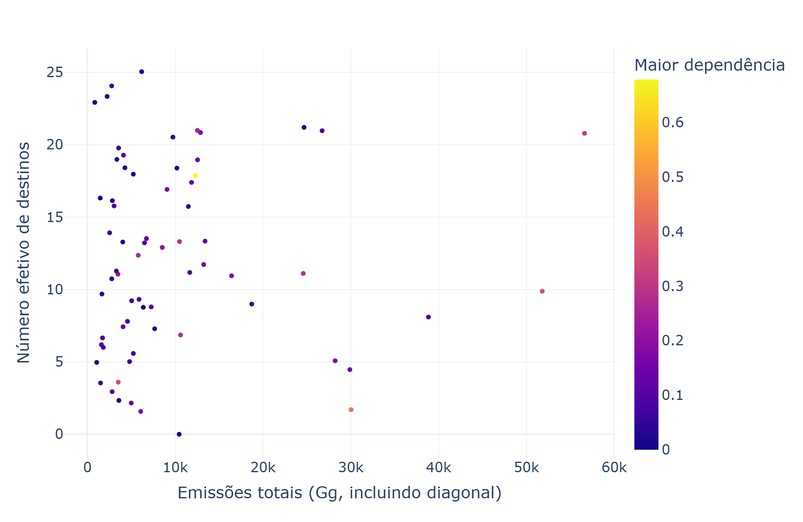

# Rede intersetorial de emissões no Brasil

Os processos produtivos geram impactos ambientais adversos. A percepção atual é de que os níveis atuais de produção são insustentáveis e de que estamos caminhando para danos irreversíveis ao ecossistema terrestre como o conhecemos ([Armstrong McKay et al., 2022](https://doi.org/10.1126/science.abn7950)).

Para poder controlar e mitigar as externalidades ambientais dos processos produtivos, é essencial que possamos quantificá-las de forma a atribuir responsabilidades aos agentes econômicos envolvidos ([Marques et al., 2012](https://doi.org/10.1016/j.ecolecon.2012.09.010)). Há ampla discussão sobre como realizar a quantificação e a responsabilização. Uma metodologia utilizada com frequência, inclusive pelo Protocolo de Kyoto ([UNFCCC, 2008](https://unfccc.int/resource/docs/publications/08_unfccc_kp_ref_manual.pdf)), atribui a responsabilidade ao território onde as emissões foram realizadas (*production-based responsibility*).

Diversos estudos foram feitos contabilizando as emissões brasileiras. Para citar dois recentes, [Sanguinet e Azzoni (2024)](https://doi.org/10.1016/j.rspp.2024.100015) e [Montoya et al. (2026)](https://doi.org/10.1007/s10668-024-05251-8). Nesses estudos, são apresentadas as emissões de cada setor produtivo de forma isolada. Essa abordagem permite identificar os maiores emissores, mas não evidencia a estrutura das relações intersetoriais associadas a essas emissões.

O presente ensaio propõe uma análise de redes para explorar a estrutura intersetorial das emissões atribuídas à produção brasileira. A análise busca identificar não apenas quais setores concentram os maiores volumes de emissões, mas também como essas emissões se distribuem entre os setores e quais deles ocupam posições estruturalmente relevantes na rede.

A primeira hipótese é de que setores com elevados níveis de emissões estejam conectados por fluxos de emissões mais intensos a outros setores também caracterizados por elevados níveis de emissões. A segunda hipótese é de que existam setores-chave com papel importante na rede, apesar de não apresentarem níveis elevados de emissões isoladamente.

A rede será construída a partir da MIP 2015, nível 67 ([IBGE](https://www.ibge.gov.br/estatisticas/economicas/contas-nacionais/9085-matriz-de-insumo-produto.html)), utilizando coeficientes de emissão propostos por [Sanguinet e Azzoni (2024)](https://doi.org/10.1016/j.rspp.2024.100015) e adotando a abordagem de responsabilidade baseada na produção discutida por [Marques et al. (2012)](https://doi.org/10.1016/j.ecolecon.2012.09.010). As relações entre os setores serão representadas por uma rede ponderada pelos volumes de emissões atribuídos às relações intersetoriais. A análise será feita em Python, utilizando a biblioteca NetworkX. O código-fonte e os resultados serão disponibilizados no [repositório do projeto](https://github.com/G-Cintra/Redes).

A partir dos resultados, serão discutidas possíveis implicações para políticas públicas e tecnologias de mitigação, considerando as propostas apresentadas por [Rissman et al. (2020)](https://doi.org/10.1016/j.apenergy.2020.114848).

## Notebooks

- [**Matriz insumo-produto**](analise_matriz_insumo_produto.ipynb): carrega a MIP e calcula a matriz de emissões.
- [**Análise de redes**](analise_redes_emissoes.ipynb): realiza a análise de redes na matriz de emissões.

## Exploração inicial

[Os resultados preliminares podem ser explorados aqui.](https://g-cintra.github.io/Redes/)

**1. Estrutura da rede.** Cada nó representa um setor. O tamanho indica suas emissões totais; a cor, o número efetivo de destinos; e a espessura das ligações, o peso da atribuição de emissões. A figura mostra as 75 maiores ligações para facilitar a leitura; os indicadores utilizam todas as ligações positivas entre setores. A posição dos nós não tem significado econômico.

**2. Concentração dos emissores.** As curvas acumulam a participação dos setores, do maior para o menor emissor. Comparam as emissões totais, incluindo atribuições ao próprio setor, com a parcela atribuída a outros setores.

**3. Volume e alcance.** Cada ponto é um setor. O número efetivo de destinos considera como suas atribuições intersetoriais se distribuem: cresce quando os pesos estão menos concentrados em poucos destinos. A cor indica a maior participação desse emissor nas emissões intersetoriais recebidas por um destino. As duas dimensões permitem examinar diferenças que um ranking de emissões, sozinho, não mostra.

As imagens abrem em tamanho completo. A exploração interativa permite identificar os setores e consultar os valores. Estes resultados são preliminares e não demonstram, por si só, o efeito de uma intervenção econômica.

## Referências

1. **Armstrong McKay, D. I. et al. (2022).** [*Exceeding 1.5°C global warming could trigger multiple climate tipping points*](https://doi.org/10.1126/science.abn7950). *Science*, 377, eabn7950.
2. **IBGE.** [*Matriz de Insumo-Produto: Brasil, 2015*](https://www.ibge.gov.br/estatisticas/economicas/contas-nacionais/9085-matriz-de-insumo-produto.html).
3. **Marques, A.; Rodrigues, J.; Lenzen, M.; Domingos, T. (2012).** [*Income-based environmental responsibility*](https://doi.org/10.1016/j.ecolecon.2012.09.010). *Ecological Economics*, 84, 57–65.
4. **Miller, R. E.; Blair, P. D. (2009).** [*Input–Output Analysis: Foundations and Extensions*](https://doi.org/10.1017/CBO9780511626982). 2ª ed. Cambridge University Press.
5. **Montoya, M. A.; Bertussi, L. A. S.; Allegretti, G.; Talamini, E. (2026).** [*Brazilian energy and carbon footprints: structural changes and sectoral contributions to climate change*](https://doi.org/10.1007/s10668-024-05251-8). *Environment, Development and Sustainability*, 28, 6725–6755.
6. **Rissman, J. et al. (2020).** [*Technologies and policies to decarbonize global industry: Review and assessment of mitigation drivers through 2070*](https://doi.org/10.1016/j.apenergy.2020.114848). *Applied Energy*, 266, 114848.
7. **Sanguinet, E. R.; Azzoni, C. R. (2024).** [*Carbon emissions drivers in Brazilian regional production chains: Value-added and consumption-based approaches*](https://doi.org/10.1016/j.rspp.2024.100015). *Regional Science Policy & Practice*, 16, 100015.
8. **UNFCCC (2008).** [*Kyoto Protocol reference manual on accounting of emissions and assigned amount*](https://unfccc.int/resource/docs/publications/08_unfccc_kp_ref_manual.pdf). United Nations Framework Convention on Climate Change.

## Reprodução da análise

Os notebooks podem ser executados em qualquer ambiente com suporte a Python e Jupyter. Clone esse repositório, prepare o ambiente com as dependências e versões especificadas em [requirements.txt](requirements.txt).

Execute integralmente as células de cada notebook, na ordem em que aparecem, seguindo esta sequência:

1. [**Matriz insumo-produto**](analise_matriz_insumo_produto.ipynb): prepara os dados e exporta a matriz de emissões atribuídas à produção brasileira e o catálogo de setores.
2. [**Análise de redes**](analise_redes_emissoes.ipynb): utiliza esses arquivos para construir a rede, calcular os indicadores e gerar as visualizações.

Os arquivos de entrada são verificados por SHA-256 conforme o [manifesto](raw/manifesto.csv), portanto mantenha os arquivos com permissões apenas para leitura. As hipóteses e decisões metodológicas estão documentadas nos notebooks. A execução da análise de redes gera as tabelas em `outputs/redes/` e a página interativa em `docs/index.html`.
