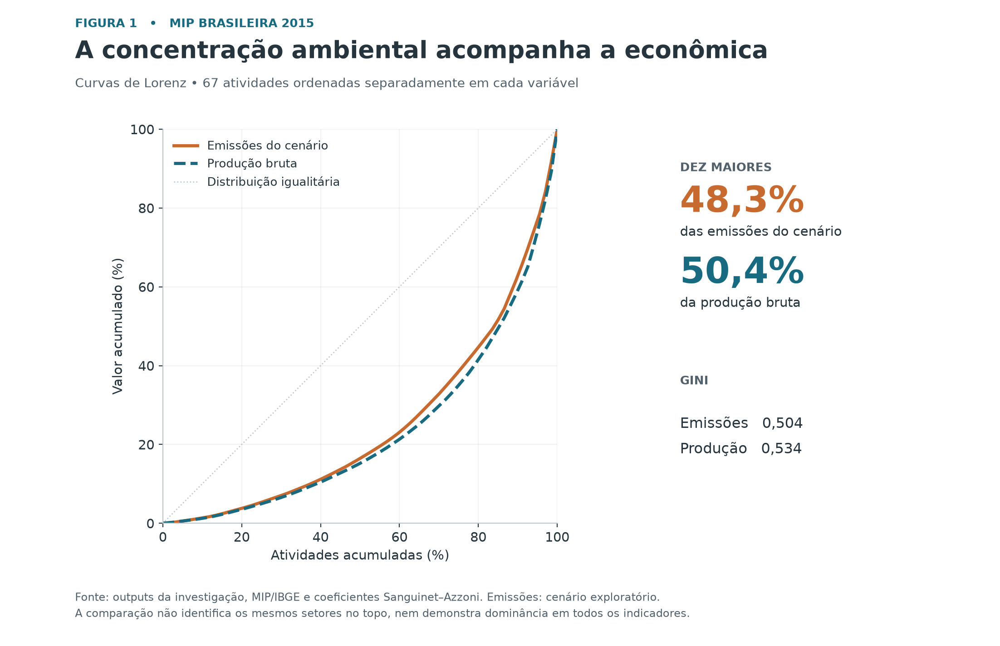
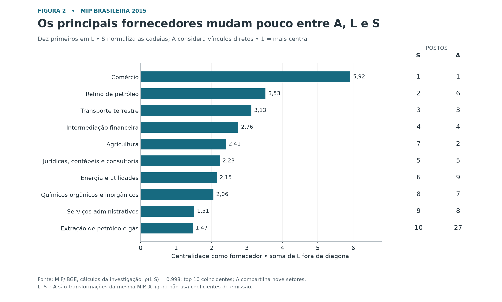
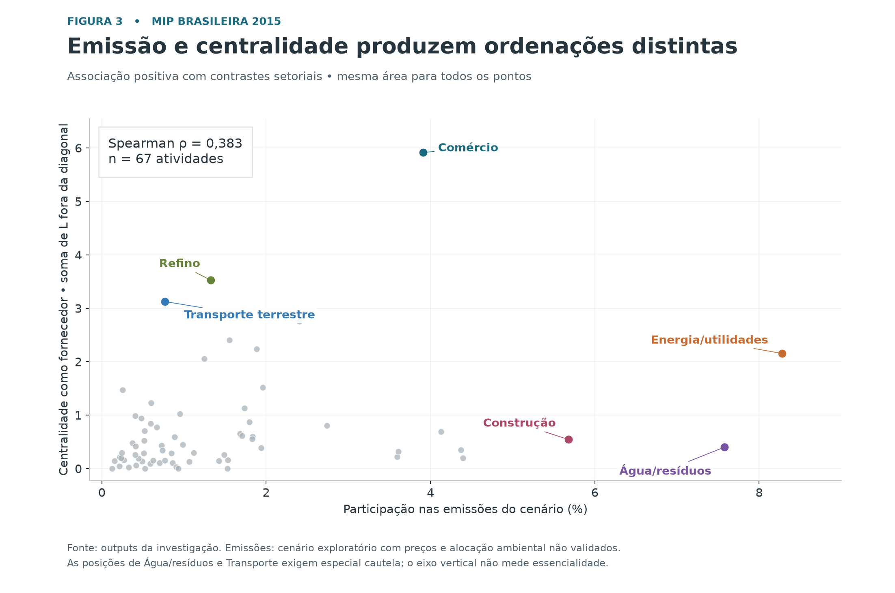
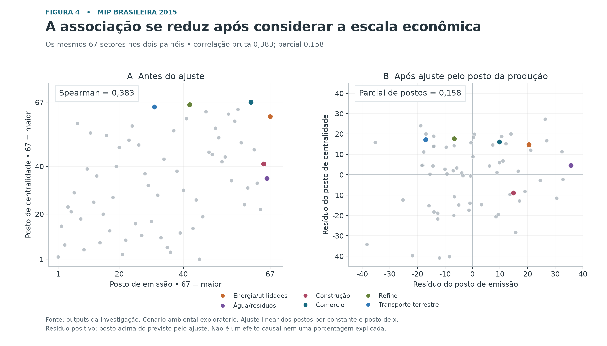

# A história do ensaio sobre emissões e fornecedores na MIP 2015

O ensaio pergunta se os setores que mais emitem também ocupam as posições mais centrais como fornecedores da economia brasileira. A história tem duas dimensões: o volume de emissão associado a cada atividade e sua presença direta e indireta nas cadeias dos demais setores. A escala econômica aproxima essas dimensões, mas elas não produzem a mesma ordenação no cenário estudado.

Este documento explica o argumento e a função de cada figura. O [ensaio desenvolvido](ensaio_redes_emissoes_2015.md) apresenta a versão acadêmica, com métodos, resultados e discussão. Ambos se referem exclusivamente à investigação da MIP de 2015.

## O argumento central

**Emitir muito e ser um fornecedor central são atributos relacionados, mas diferentes.** Um setor pode apresentar grande emissão porque produz muito, porque tem intensidade ambiental elevada ou por uma combinação dessas condições. Sua posição como fornecedor depende dos requerimentos produtivos das outras atividades, incluindo os encadeamentos indiretos. A produção bruta participa dessa relação, mas o ranking de fornecedores não é simplesmente um ranking de tamanho.

A evidência disponível permite contar essa história como um ensaio exploratório. A hierarquia de fornecedores está bem estabelecida dentro da MIP. A parte ambiental usa coeficientes cuja transcrição é correta, mas cuja compatibilidade monetária e alocação física permanecem insuficientemente validadas. Por isso, a frase principal precisa terminar com uma delimitação: **essa combinação de associação e diferença aparece no cenário ambiental utilizado; sua confirmação para as emissões próprias brasileiras de 2015 exige uma extensão ambiental reconciliada.**

O ensaio não procura provar que emissão e centralidade são independentes, identificar setores insubstituíveis ou recomendar uma ordem de intervenção climática. Ele separa atributos que podem ser confundidos quando se usa apenas uma lista de setores “mais importantes”.

## A abertura

Uma abertura possível é: “Uma economia concentra parte de sua produção e de suas emissões em poucas atividades. Mas saber onde se concentra a emissão não informa, por si, quais setores fornecem os insumos que atravessam as demais cadeias. Para compreender essa relação, é preciso distinguir volume emitido, escala econômica e posição produtiva.”

Essa formulação apresenta um problema que a MIP pode ajudar a examinar. A pergunta é sobre a posição do fornecedor nos requerimentos contábeis de produção. Não exige tratar a economia como uma rede de paralisações, nem transformar centralidade em essencialidade.

## Figura 1 A concentração como ponto de partida

**Pergunta:** a concentração das emissões é excepcionalmente elevada quando comparada à concentração da própria atividade econômica?

As curvas de Lorenz mostram que ambas as distribuições são desiguais. No cenário interpolado, os dez maiores emissores somam 48,3% das emissões, enquanto os dez maiores produtores representam 50,4% da produção bruta. O Gini é 0,504 para emissão e 0,534 para produção. Esses indicadores não sustentam uma descrição da concentração ambiental como muito superior à econômica.

A figura abre o argumento sem antecipar quais setores são centrais. Cada variável é ordenada separadamente: a semelhança das curvas não implica identidade dos setores nos primeiros lugares. Também não demonstra dominância em todos os indicadores ou cenários.

**Transição:** “Distribuições de concentração parecidas podem ser formadas por setores diferentes. Precisamos agora identificar a posição de cada atividade nas cadeias produtivas.”

## Figura 2 A hierarquia dos fornecedores

**Pergunta:** quais atividades aparecem como fornecedoras diretas e indiretas nas cadeias dos demais setores?

As barras mostram a soma da linha de L fora da diagonal. Comércio, Refino e Transporte terrestre ocupam os três primeiros lugares. As colunas laterais informam os postos em S, que padroniza cada cadeia, e em A, que considera os vínculos diretos. L e S compartilham os mesmos dez primeiros setores e têm correlação de postos de 0,998; A compartilha nove desses dez.

Essa é a parte mais firme da história, pois independe dos coeficientes de emissão. A normalização altera pouco a hierarquia geral, e os principais fornecedores já estão bastante visíveis nos vínculos diretos. Algumas posições mudam: Refino passa do sexto posto em A ao segundo em L; Extração de petróleo e gás, do 27º ao décimo. A semelhança global não significa igualdade em todos os casos.

A figura não soma três confirmações independentes. Ela mostra a estabilidade de uma hierarquia em transformações relacionadas da mesma MIP. Seus valores tampouco representam perdas econômicas caso um setor deixe de produzir.

**Transição:** “Identificados os fornecedores centrais, podemos comparar essa posição com o volume de emissão atribuído a cada atividade.”

## Figura 3 A relação entre emissão e centralidade

**Pergunta:** os setores que aparecem à direita, com maior participação emissora, também aparecem no alto, com maior centralidade como fornecedores?

A correlação de Spearman é positiva, 0,383, mas a dispersão mostra diferenças relevantes. Energia/utilidades combina a maior emissão do cenário com o sétimo posto em L. Comércio ocupa o primeiro posto estrutural e o sétimo ambiental. Água/resíduos e Construção têm posições ambientais elevadas e postos produtivos mais baixos. Refino e Transporte terrestre exibem o contraste inverso.

O núcleo do ensaio está aqui: há associação, sem coincidência das ordenações. A diferença absoluta mediana entre os postos é de 16 posições. Os seis destaques ajudam o leitor a entender a dispersão; não definem grupos naturais ou uma classificação completa da economia.

É também aqui que a qualidade ambiental mais importa. Água/resíduos depende de uma intensidade atribuída particularmente elevada; Transporte terrestre depende de um coeficiente baixo cuja correspondência com fontes físicas não foi reconciliada. Esses contrastes ilustram o cenário, mas ainda não podem ser apresentados como resultados ambientais definitivos.

**Transição:** “Parte dessa associação pode acompanhar uma característica comum: o tamanho econômico. Setores de maior produção tendem a ter maior emissão quando a intensidade é mantida, e a produção também se associa à centralidade.”

## Figura 4 O papel da escala econômica

**Pergunta:** como fica a associação após retirar de ambos os conjuntos de postos sua relação linear com o posto da produção bruta?

O primeiro painel apresenta a associação de postos original. O segundo mostra os resíduos do ajuste por tamanho para os mesmos 67 setores. A correlação cai de 0,383 para 0,158. Essa atenuação é compatível com a participação da escala econômica no padrão observado, mas não identifica um mecanismo causal.

A figura usa postos crescentes: 67 corresponde ao maior valor. No segundo painel, um resíduo positivo significa um posto acima do previsto pelo ajuste linear por tamanho. As escalas dos painéis são diferentes porque as variáveis do segundo são resíduos. Não se deve interpretar a diferença entre correlações como porcentagem “explicada”, nem chamar esses resíduos de uma nova centralidade.

**Transição para a conclusão:** “O cenário combina associação positiva, diferenças setoriais e atenuação após considerar a escala. O que permanece incerto é se a extensão ambiental representa adequadamente as emissões próprias que queremos estudar.”

## O fechamento

A conclusão tem dois graus de sustentação. A MIP identifica uma hierarquia de fornecedores que se mantém próxima sob L, S e A. Esse resultado pode ser defendido dentro das convenções da análise. A associação com as emissões, entretanto, permanece condicionada a uma base ambiental classificada como **C, útil apenas como proxy exploratória**.

Assim, o ensaio já tem uma pergunta clara, um resultado estrutural e uma sequência empírica inteligível. A etapa necessária para fortalecer sua conclusão é reconciliar ou substituir os coeficientes ambientais e reaplicar a mesma especificação. Uma alteração no ranking emissor deve poder mudar a conclusão; a métrica de rede não será escolhida novamente para preservar a história.

Uma formulação de encerramento é: “A posição de um setor nas cadeias produtivas acrescenta informação ao seu volume de emissão. No cenário estudado, as duas dimensões estão associadas, mas produzem ordenações distintas, e sua associação diminui após ajuste por escala. A hierarquia estrutural está estabelecida; a confirmação ambiental depende de dados físicos e monetários compatíveis com 2015.”

## Arquivos e reprodução

As quatro figuras estão em [PNG, SVG e PDF](../outputs/investigacao_redes_2015/ensaio/). O [notebook das figuras](../outputs/investigacao_redes_2015/ensaio/figuras_ensaio.ipynb) lê os outputs históricos, confere os cálculos e registra hashes e versões. SVG e PDF preservam elementos vetoriais para edição e diagramação.

O [relatório de auditoria](auditoria_coeficientes_emissoes_2015.md) contém a avaliação da base e os diagnósticos suplementares; a [especificação final](especificacao_final_pesquisa_2015.md) registra as definições adotadas. As quatro figuras seguem a sequência narrativa aprovada para este ensaio, ampliando a apresentação de duas figuras prevista anteriormente sem acrescentar métricas de rede.
