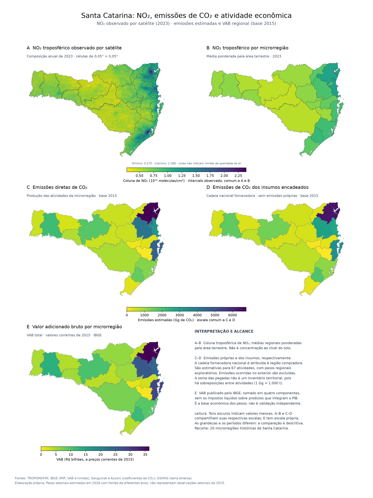

# Microrregiões de SC: satélite e emissões da MIP

Frente independente, documentada somente nesta pasta. O painel reúne NO₂ real de satélite de 2023 e duas contas de CO₂ de 2015, calculadas com a produção e a tecnologia nacionais da MIP e regionalizadas por pesos setoriais estimados, ancorados em VAB público. **As 67 atividades têm perfis estimados para as 20 microrregiões. Os fatores são hipóteses informadas por pesquisa, não estatísticas setoriais observadas nem uma MIP microrregional.**



[SVG do painel](figuras/painel_cinco_mapas_2023_viridis.svg) · [Pesos por setor e microrregião](dados/pesos_setores_microrregioes_2015.csv) · [Emissões regionalizadas](dados/emissoes_mip_microrregioes_2015.csv) · [Inventário de entradas e hashes](dados/entradas.csv).

## Reproduzir

Python 3.12. Da raiz do repositório:

```powershell
.venv\Scripts\python.exe -m pip install -r microrregioes_sc\requirements.txt
.venv\Scripts\python.exe microrregioes_sc\painel.py --ano 2023
.venv\Scripts\python.exe -m unittest discover -s microrregioes_sc -p test_*.py
```

Ou, a partir desta pasta, `python painel.py --ano 2023`. A reprodução usa cópias locais da P, dos pesos, do recorte de satélite e dos polígonos, sem internet. O notebook **explorar_mapas.ipynb** mostra as entradas, o cálculo das médias, as contas gamma × x e (gamma @ L) × x, os pesos e a composição final. Matplotlib desenha; netCDF4 lê os arquivos de satélite; Shapely calcula interseções; pyproj calcula áreas; pyshp lê GSHHG. Não foram alterados o README principal nem os cálculos da análise MIP original.

Saídas principais:

- `figuras/painel_cinco_mapas_2023_viridis.png` e `.svg`: cinco painéis, com Viridis invertida em todos os mapas.
- `figuras/emissoes_diretas_mip_2015.svg` e `emissoes_insumos_mip_2015.svg`: mapas individuais calculados com a MIP.
- `dados/mip_setores_microrregioes_2015.csv`: produção bruta estimada (R$ milhões) e emissões (Gg de CO₂) das 67 atividades em cada uma das 20 regiões.
- `dados/emissoes_mip_microrregioes_2015.csv`: totais regionais das duas contas.
- `dados/no2_microrregioes_2023.csv`: médias terrestres de NO₂ e cobertura espacial.

## Pesos regionais: pesquisa e escolha da base

Usamos o **PIB dos Municípios, IBGE/SIDRA, tabela 5938, ano 2015**, que divulga VAB por microrregião histórica, UF e Brasil. Os dados foram obtidos diretamente pela [API de agregados do IBGE](https://servicodados.ibge.gov.br/api/v3/agregados/5938/metadados), preservados em `dados/sidra_vab_2015.json`. A URL exata, data de consulta e hashes estão em `dados/regionalizacao_fontes.json`. Ver também [tabela 5938](https://sidra.ibge.gov.br/tabela/5938) e [publicação do IBGE sobre os resultados de 2015](https://agenciadenoticias.ibge.gov.br/agencia-sala-de-imprensa/2013-agencia-de-noticias/releases/18785-pib-dos-municipios-2015-capitais-perdem-participacao-no-pib-do-pais).

A pesquisa também identificou [CEMPRE/SIDRA 6450](https://servicodados.ibge.gov.br/api/v3/agregados/6450/metadados), com unidades locais e pessoal ocupado por CNAE. Para esta implementação, optamos pelo VAB: permite uma distribuição monetária transparente no mesmo ano da P, incluindo agropecuária e administração pública, sem introduzir uma conversão detalhada CNAE–SCN ou tratar emprego formal como toda a produção. **O custo dessa escolha é a baixa resolução setorial dos pesos.** Não foi realizada uma comparação empírica entre as duas alternativas.

| Grupo do VAB | Variável SIDRA | Correspondência aplicada às atividades de P |
| --- | --- | --- |
| Agropecuária | 513 | Agricultura, pecuária, produção florestal, pesca e aquicultura (0191, 0192, 0280) |
| Indústria | 517 | Extração, transformação, eletricidade, água/resíduos e construção |
| Serviços, exclusive administração pública | 6575 | Comércio e demais serviços, inclusive educação e saúde privadas |
| Administração, defesa, educação e saúde públicas e seguridade social | 525 | 8400, 8591 e 8691 |

### Estimativas específicas para as 67 atividades

`dados/fatores_setoriais_estimados.csv` é a entrada editável: uma linha para cada atividade e uma coluna para cada microrregião (códigos 42001–42020), totalizando **1.340 fatores explícitos**. Inclui justificativa, fontes de contexto e confiança quantitativa baixa ou muito baixa. A correspondência código/nome está no arquivo de pesos. Nenhum fator foi sorteado e nenhuma célula ausente recebe valor implícito.

Os fatores são **julgamentos do cenário**: 1 é neutro; 3 dá três vezes a massa inicial antes da normalização; 0,1 atenua essa massa. Não são participações publicadas, quocientes locacionais medidos nem probabilidades. Todos os fatores atuais são positivos: uma estimativa positiva não comprova existência de estabelecimento. Para extração de petróleo e minerais metálicos, açúcar e refino, a evidência é especialmente fraca; suas linhas estão marcadas com confiança muito baixa.

Fontes e evidências resumidas constam de `dados/fontes_perfis_setoriais.json`. A pesquisa usou [história industrial da FIESC](https://fiesc.com.br/pt-br/imprensa/superar-desafios-e-historia-da-industria), [diversificação do Oeste](https://fiesc.com.br/imprensa/muito-mais-do-que-aves-e-suinos), [história dos polos ACATE](https://www.acate.com.br/noticias/acate-completa-30-anos-e-comemora-consolidacao-do-setor-em-sc/), [produção BMW em Araquari em 2014](https://www.press.bmwgroup.com/portugal/article/detail/T0194787PT/bmw-group-assembles-first-car-in-brazil?language=pt), fontes locais e Wikipédia. **As fontes sustentam contextos qualitativos; todos os multiplicadores e extrapolações são nossos.** Para serviços sem informação específica, inferimos centralidade urbana e demanda local, registradas como `HIPOTESE`.

Há fontes posteriores a 2015: o resultado é um cenário com base monetária de 2015 e vocações inferidas a partir de informação multitemporal, não uma observação histórica de 2015. Cidades e mesorregiões citadas nas fontes foram associadas às microrregiões históricas; essas unidades territoriais não são intercambiáveis.

Para região r e atividade i do grupo g(i):

```text
b[r,i] = VAB[r,g(i)] / VAB[Brasil,g(i)]
q[i] = soma_r b[r,i]
w[r,i] = q[i] * b[r,i] * fator[r,i] / soma_r(b[r,i] * fator[r,i])
```

Isso altera a distribuição dentro de SC e preserva **exatamente o subtotal estadual de cada atividade** do cenário anterior. Portanto, as somas estaduais de diretas e totais também são preservadas. A escala SC/Brasil ainda é a aproximação por quatro grupos: não estimamos uma nova composição setorial estadual. Essa limitação pode superestimar em SC atividades raras ou inexistentes; fatores regionais não corrigem esse problema. O setor energia mantém a intensidade nacional: localizar produção em Tubarão não equivale a estimar emissões reais de uma termelétrica.

O arquivo efetivamente consumido, `dados/pesos_setores_microrregioes_2015.csv`, contém os 1.340 pares, pesos ajustados, fatores, base VAB anterior, URLs e justificativas. `peso_micro_brasil` alimenta os mapas; `peso_micro_sc` soma 1 por atividade. A coluna `peso_sc_brasil` preserva a soma das micros do cenário anterior, com seu arredondamento SIDRA. A base sem fatores está em `dados/pesos_vab_quatro_grupos_2015.csv`.

Para editar hipóteses, altere o CSV de fatores e execute `python regionalizacao.py`, seguido de `python painel.py`. O painel verifica hashes e rejeita pesos desatualizados. O arquivo `dados/sensibilidade_perfis_setoriais.csv` compara fator elevado a 0 (VAB antigo), 0,5 (ajuste atenuado), 1 (cenário do mapa) e 1,5 (reforçado). É sensibilidade a hipóteses, **não intervalo de confiança estatístico**; para refazê-lo execute `python regionalizacao.py`.

## Emissões diretas e totais para a mesma produção

Para cada atividade j, usamos a produção bruta nacional x[j], a intensidade direta gamma[j] e a inversa de Leontief nacional L = (I-A)^-1:

```
diretas[j] = gamma[j] * x[j]
insumos[j] = (gamma @ (L-I))[j] * x[j]
totais[j]  = (gamma @ L)[j] * x[j] = diretas[j] + insumos[j]
diretas_regiao[r,j] = peso[r,j] * diretas[j]
totais_regiao[r,j]  = peso[r,j] * totais[j]
```

O mapa C representa apenas as emissões próprias da produção estimada na região. O mapa D representa somente os insumos encadeados: `totais − diretas`, incluindo fornecedores nacionais de todas as etapas e fornecedores do mesmo setor. As emissões próprias de C não entram em D. O total permanece nos CSVs para auditoria. A região é a da atividade compradora: os fornecedores podem estar em outras regiões. **O total já inclui o direto.** As cores somam as contas das 67 atividades de cada microrregião.

**Escopo: cadeia nacional, sem emissões ocorridas no exterior.** A matriz A contém insumos nacionais; não se presume que importações tenham emissão zero, mas suas emissões não são estimadas aqui. As pegadas da produção bruta se sobrepõem entre atividades (por exemplo, eletricidade própria e eletricidade comprada pela indústria); sua soma é um indicador de pegadas setoriais, não um inventário territorial sem dupla contagem. A hipótese de tecnologia linear da MIP permanece; a localização é estimada pelos fatores setoriais sobre VAB.

`dados/tecnologia_nacional_2015.npz` preserva x, gamma e L, com códigos e hash em `mip_fontes.json`. `mip.importar_tecnologia()` reconstrói essa entrada pelas funções existentes em `redes`: x da tabela 01, A=D@Bn das tabelas 13 e 11, gamma interpolado entre 2011 e 2018 (peso 4/7). Essa reconstrução usa pandas e xlrd das dependências do repositório; a reprodução do painel usa apenas a cópia local.

A matriz P da análise original é preservada e usada para verificar `P.sum(axis=1) = gamma*x`. A soma das colunas de P atribui emissões à demanda final e **não é mais usada como mapa total**. A diagonal de P não é o componente direto. `mip_totais_setoriais_2015.csv` e os dois CSVs regionalizados expõem diretas, insumos e totais separadamente.

Mantemos a interpolação das intensidades e a aproximação monetária adotadas na análise original. Não presumimos a mesma revisão estatística entre a MIP e o VAB municipal disponível no SIDRA.

## Satélite e terra emersa

O produto é a composição anual **TROPOMI/FMI de NO₂ de 2023**, grade de 0,05°, obtida em [FMI/SAMPO](https://sampo.fmi.fi/tropomi_l3/info_dev.php). O histórico do NetCDF registra o filtro `validity > 75`, restrição de ângulo horário solar e as agregações HARP. O produto declara `processor_version=2.5.0`; esse atributo não garante homogeneidade de versão de todas as órbitas. Metadados, URL e hashes estão em `dados/no2_fmi_2023_fontes.json`.

`python satelite.py --ano 2023` reproduz os mapas de NO₂. Outro ano completo desde 2019 exige baixar o arquivo global correspondente, se disponível. O download inicial tem cerca de 475 MB, mais cerca de 623 MB descompactados; esses arquivos ficam no cache ignorado pelo Git. O recorte pequeno (`dados/no2_fmi_2023_sc.npz`) está incluído. Sem cadastro ou chave de API.

Os limites históricos do IBGE incluem águas costeiras. `territorio.py` os intersecta com a terra **GSHHG 2.3.7, resolução completa**, removendo a água cartografada: `(L1 − L2) ∪ L3 − L4`. A fonte e referência são [GSHHG, Wessel e Smith](https://www.soest.hawaii.edu/pwessel/gshhg/). O recorte preserva a Ilha de Santa Catarina, com licença e hashes em `dados/terra_fontes.json`; a geometria usada é `dados/microrregioes_sc_terra.geojson`. A base é histórica: rios estreitos e água não cartografada podem permanecer.

Média regional: `NO2[r] = Σ_p A_terra[r,p] × NO2[p] / Σ_p A_terra[r,p]`, sobre células finitas com peso HARP positivo. As áreas são calculadas em projeção equivalente LAEA centrada em 27° S, 51° W. Valores negativos válidos são preservados. A água é excluída do peso, e não apenas ocultada na figura. A observação L3 de uma célula costeira continua misturando sua área original: esta operação não separa sinais subpixel de terra e mar.

A média temporal é a composição anual do fornecedor; não a recalculamos atribuindo pesos iguais aos dias. O peso HARP não é número de dias válidos. A cobertura exportada é espacial, não temporal, e não mede incerteza. O histórico de agregação encontra-se no manifesto; ver [HARP](https://stcorp.github.io/harp/doc/html/algorithms/regridding.html). A consulta `preparar_consulta_satelite.py` é uma alternativa Earth Engine, com outra grade e agregação temporal, e não reproduz exatamente o produto FMI; sua execução remota não foi validada.

Unidade: 10¹⁵ moléculas/cm²; para mol/m², multiplicar por `10¹⁹ / 6,02214076×10²³`. A tabela também fornece a conversão. NO₂ é coluna atmosférica, não fluxo de emissões de CO₂. Ventos, nuvens, química e fontes naturais afetam a comparação; satélite de 2023 e MIP de 2015 não validam um ao outro diretamente. Referências: [validação TROPOMI, Verhoelst et al. (2021)](https://amt.copernicus.org/articles/14/481/2021/) e [inferência de emissões NOx, Lange et al. (2022)](https://acp.copernicus.org/articles/22/2745/2022/).

`dados/no2_correcao_terra_2023.csv` registra a mudança autorizada de domínio em relação às antigas médias que incluíam baías. `dados/no2_agregacao_2023_fontes.json` identifica a agregação corrigida. Os arquivos de aquisição não foram reescritos para ocultar essa mudança.

## Leitura das cores e exemplo sintético

**Escala de NO₂:** A e B compartilham a normalização linear entre o mínimo e o máximo das células válidas que interceptam a terra de SC, sem forçar a origem em zero. O mínimo e o máximo são informados na figura e no manifesto. A legenda mantém as unidades físicas: nenhum valor foi subtraído dos dados, nenhuma célula foi truncada e as médias regionais não foram recalculadas. A finalidade é mostrar contraste espacial, não classificar qualidade do ar. O mínimo observado não estima fundo natural nem um nível seguro. A coluna troposférica não é a concentração ao nível do solo; sua conversão requer informação adicional ([documentação do produto Sentinel-5P](https://sentiwiki.copernicus.eu/web/s5p-products), [estudo KNMI sobre inferência de concentrações superficiais](https://www.knmi.nl/kennis-en-datacentrum/publicatie/comparison-of-s5p-tropomi-inferred-no2-surface-concentrations-with-in-situ-measurements-over-central-europe-84829a9c-8f4d-44de-ba2b-a171c1a251f2)). A escala depende deste recorte e deste ano; comparar outros anos exige fixar limites comuns.

Comparação do painel completo: [Inferno](figuras/painel_cinco_mapas_2023_inferno.png), [Magma](figuras/painel_cinco_mapas_2023_magma.png), [Plasma](figuras/painel_cinco_mapas_2023_plasma.png) e [Viridis](figuras/painel_cinco_mapas_2023_viridis.png). Todas usam a direção invertida (valores altos escuros), com dados e limites numéricos idênticos entre versões. Há também arquivos SVG. Reproduza com `python painel.py --paleta inferno`, substituindo o nome pela opção desejada.

As versões Viridis e Cividis usam as paletas invertidas (`viridis_r` e `cividis_r`): amarelo claro para valores baixos e tons escuros para valores altos. A inversão altera apenas as cores, preservando os limites numéricos compartilhados entre C e D.

O painel atual tem cinco mapas e usa Viridis invertida por padrão. `python painel.py --paleta viridis` o reproduz; `--paleta cividis` oferece uma alternativa invertida para todos os mapas. A e B compartilham a escala de NO₂; C e D compartilham a escala de CO₂; E usa uma escala própria de VAB. Cores iguais entre grandezas distintas não significam valores comparáveis. As antigas imagens de quatro painéis permanecem como versões anteriores.

A revisão editorial do painel prioriza uma leitura autônoma: o título identifica as grandezas, o subtítulo distingue observações de estimativas e explicita os anos, e cada painel informa seu objeto e sua agregação. “Emissões da MIP” foi substituído por emissões de CO₂, reservando a origem metodológica às fontes. As notas esclarecem que NO₂ é coluna troposférica, que os insumos são atribuídos à região compradora e que a soma das pegadas não é um inventário territorial. O cenário estimado e a diferença temporal permanecem visíveis. Informações operacionais, fórmulas e justificativas dos pesos ficam nesta documentação e no notebook. A revisão altera a apresentação, sem modificar valores, limites das escalas ou geometrias.

Todos os cinco mapas usam Viridis invertida: amarelo para valores baixos e roxo escuro para valores altos. A/B usam a mesma normalização linear de NO₂; C/D usam a mesma normalização linear de CO₂, de zero ao maior valor entre as duas contas; E usa de zero ao maior VAB regional. C e D mostram valores absolutos em Gg, não intensidade por área ou população.

O exemplo aleatório original permanece em `dados/emissoes_exemplo.csv` (uniforme 100–1000, semente 42); `python mapas.py` gera apenas esse exemplo. Ele **não entra no painel nem nos mapas com sufixo mip_2015**. `mapas.py` também aceita `--entrada`, `--unidade`, `--nota` e `--saida`, para CSV UTF-8 com `microrregiao,emissoes_diretas,emissoes_encadeadas`, exigindo as 20 regiões, sem duplicação ou valores negativos/ausentes. `preparar_dados.py` refaz a malha administrativa e o exemplo; depois disso, refaça `territorio.py` caso o hash da malha mude.

## VAB por microrregião (painel E)

`carregar_vab()` em `regionalizacao.py` lê a resposta SIDRA 5938 já congelada, confere o hash e soma as variáveis 513 (agropecuária), 517 (indústria), 6575 (serviços exceto administração pública) e 525 (administração pública). Os componentes são disjuntos: a administração pública não é contada duas vezes. A soma das 20 microrregiões é confrontada com o total estadual, admitindo arredondamento da publicação.

Os dados vêm em **mil reais**; a divisão por **1.000.000** gera os **bilhões de reais** usados no mapa, a preços correntes de 2015. VAB não é PIB: os impostos líquidos sobre produtos não estão incluídos. O CSV `dados/vab_microrregioes_2015.csv` expõe os quatro componentes, o total e a conversão, mantendo o nome original SIDRA e o nome cartográfico alinhados pelo código IBGE. O mapa individual está em `figuras/vab_microrregioes_2015_viridis.svg`.

O VAB é uma estatística publicada, ao contrário dos fatores setoriais julgamentais de C e D. Contudo, ele também é a base dos pesos que regionalizam as emissões: a comparação visual com C e D não constitui validação independente. A agregação econômica não é multiplicada pela fração de terra; a máscara terrestre afeta o desenho e a ponderação espacial de NO₂.

## Inventário das entradas

| Entrada | Fonte / período | Papel e localização |
| --- | --- | --- |
| MIP brasileira | IBGE, 2015, 67 atividades | `../raw/Matriz_de_Insumo_Produto_2015_Nivel_67.xls`; alimenta o notebook original. [Fonte IBGE](https://ftp.ibge.gov.br/Contas_Nacionais/Matriz_de_Insumo_Produto/2015/) |
| Coeficientes de CO₂ | Sanguinet e Azzoni (2024), valores de 2011 e 2018 | `../raw/coeficientes_co2_sanguinet_azzoni_2011.csv` e `_2018.csv`; interpolação linear para 2015: γ2011 + 4/7 × (γ2018 − γ2011). [Referência do projeto](../references/sanguinet_azzoni_2024/README.md) |
| Matriz P | Análise MIP deste repositório, 2015 | Cópia em `dados/matriz_p_nacional_2015.csv`; verificação das emissões diretas; linhas somam gamma × x |
| Tecnologia nacional | Mesmas fontes da MIP, 2015 | `dados/tecnologia_nacional_2015.npz`: gamma, x e L para calcular diretas e totais |
| Satélite | Sentinel-5P/TROPOMI, composição FMI, 2023 | `dados/no2_fmi_2023_sc.npz` e seu manifesto; fonte dos dois mapas de NO₂ |
| Base econômica regional | IBGE/SIDRA 5938, VAB de 2015, quatro grupos | `dados/sidra_vab_2015.json`; dados reais de Brasil, SC e 20 microrregiões |
| Pesos da MIP por microrregião | Produzidos nesta frente a partir do VAB | `dados/pesos_setores_microrregioes_2015.csv`; 1.340 pares ajustados por hipóteses setoriais. Não é uma MIP inter-regional observada |
| Hipóteses setoriais | Pesquisa online e julgamento, cenário de 2026 | `dados/fatores_setoriais_estimados.csv` e `dados/fontes_perfis_setoriais.json`; fatores não observados |
| Geometria terrestre | Microrregiões históricas IBGE × GSHHG 2.3.7 | `dados/microrregioes_sc_terra.geojson`; exclui águas cartografadas |

`dados/entradas.csv` registra caminhos, períodos, papéis e hashes. `dados/painel_cinco_mapas_fontes_viridis.json` registra exatamente P, tecnologia, pesos, fatores estimados, fontes dos perfis, emissões regionalizadas, satélite e terra usados na figura. Os arquivos originais da MIP e dos coeficientes são entradas anteriores à P e não são recalculados pelo painel; as cópias locais permitem reproduzir a figura independentemente deles.
