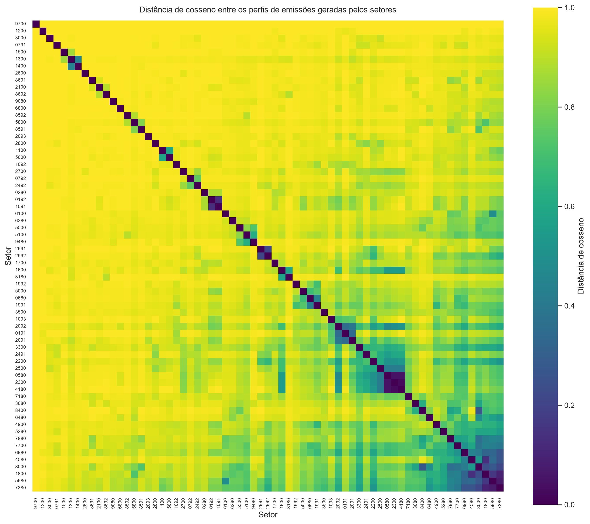
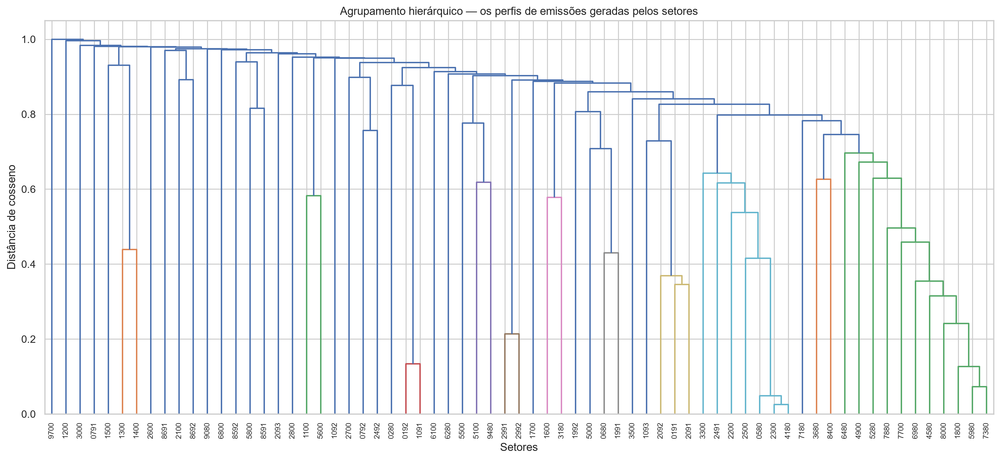
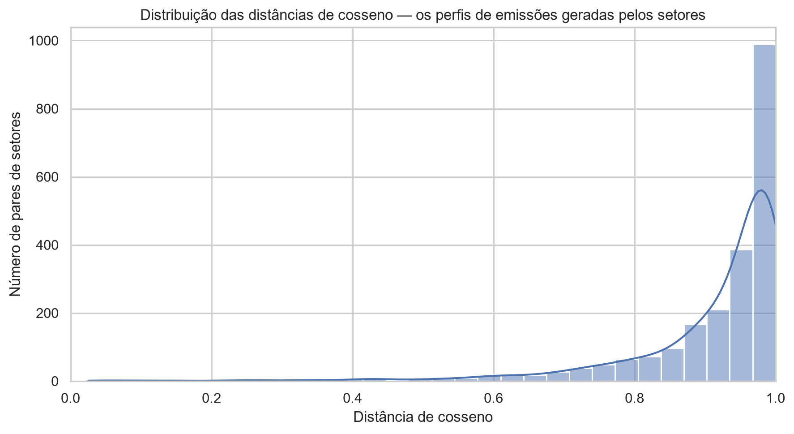
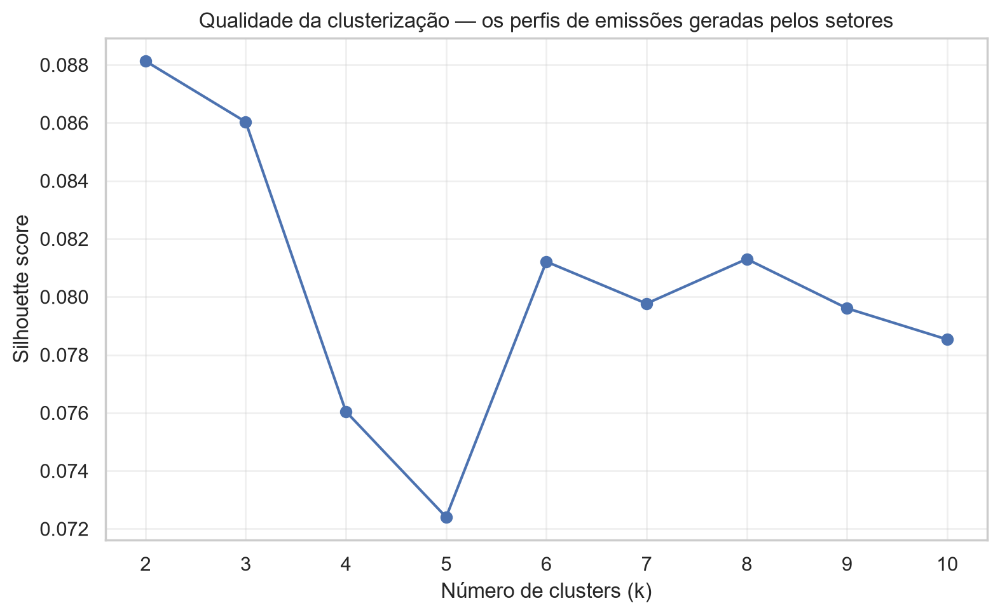
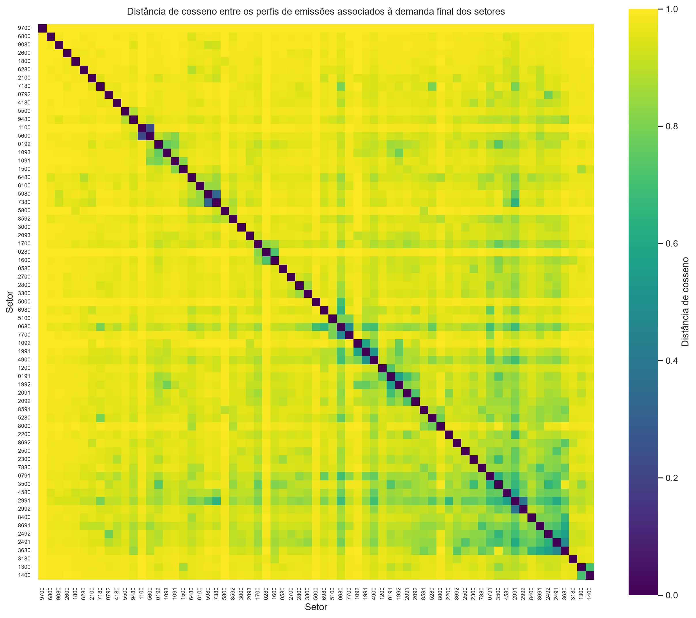
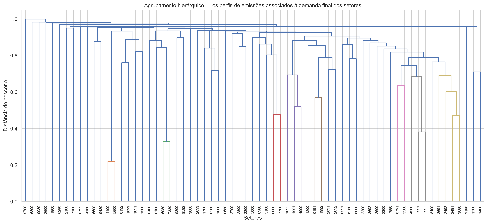
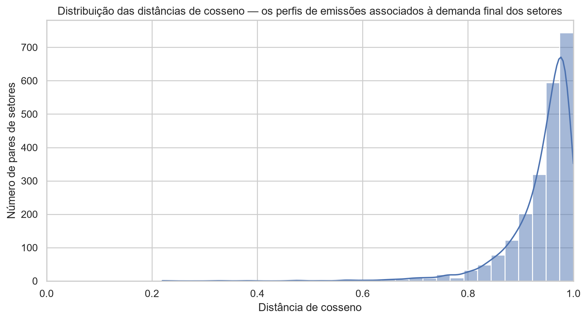
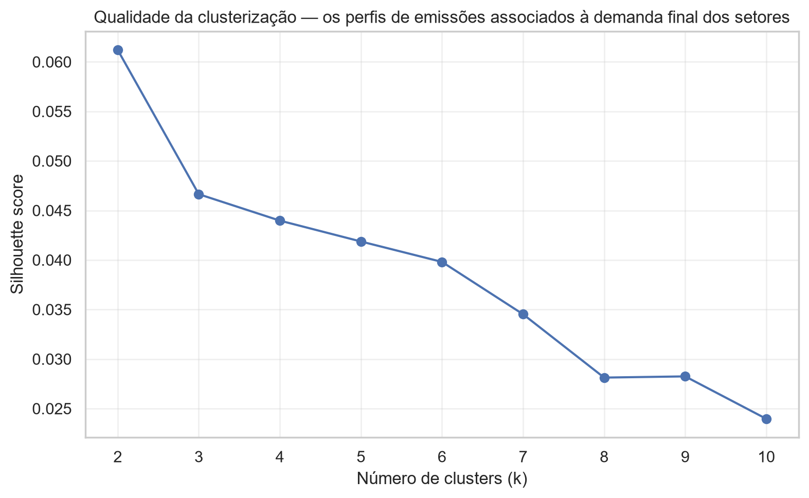
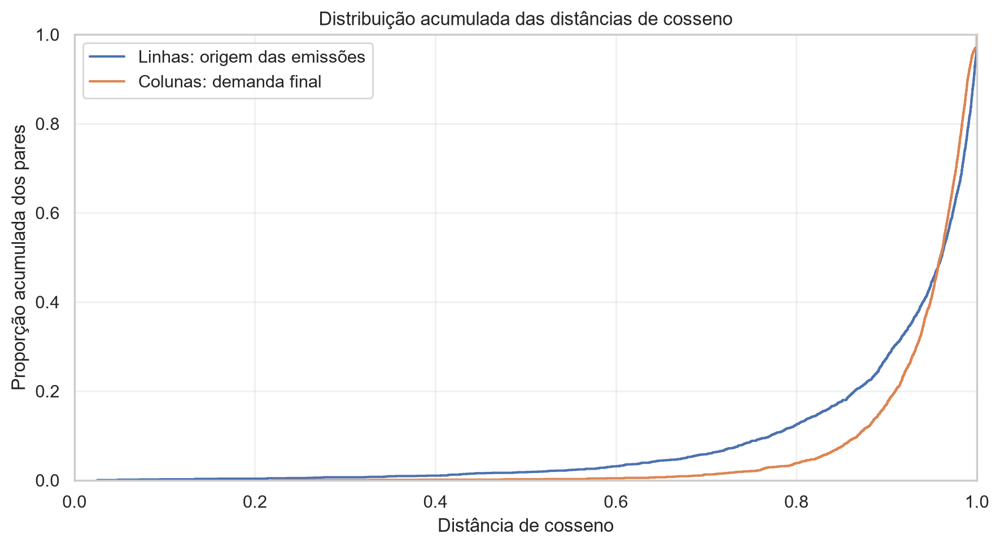
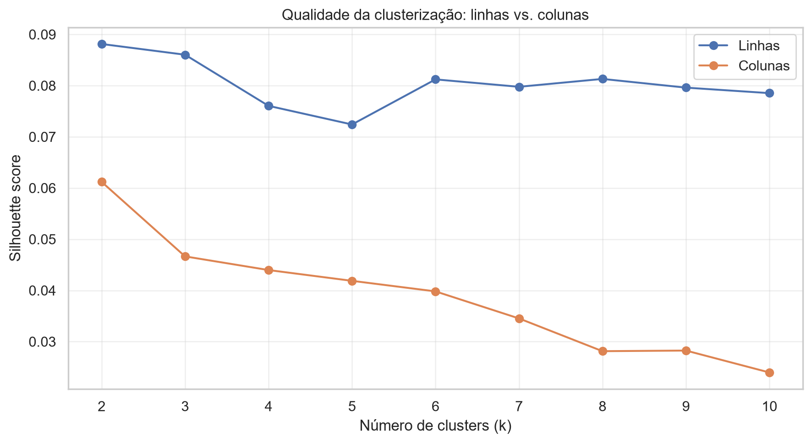

# Similaridade dos perfis da rede de emissões intersetoriais

## Objetivo

Esta análise investiga se os setores apresentam padrões semelhantes de conexões
na rede de emissões intersetoriais. A comparação é realizada separadamente para
as linhas e para as colunas da matriz de fluxos de emissões.

A distância de cosseno entre dois vetores $a$ e $b$ é definida por

$$
d_{cos}(a,b)
=
1 -
\frac{a \cdot b}
{\|a\|\|b\|}.
$$

Valores próximos de zero indicam perfis semelhantes. Como os fluxos analisados
são não negativos, valores próximos de um indicam perfis fortemente distintos.

A distância de cosseno compara a **forma ou composição dos vetores**, e não sua
magnitude absoluta. Dois setores podem, portanto, apresentar volumes totais de
emissões muito diferentes e ainda possuir perfis semelhantes.

---

## Interpretação das linhas e colunas

### Linhas

Cada linha $F_{i\cdot}$ descreve como as emissões geradas pelo setor $i$ estão
distribuídas entre os diferentes setores de demanda final.

A comparação entre linhas identifica setores de origem das emissões que ocupam
posições semelhantes na estrutura observada das cadeias produtivas.

Como

$$
F = C\hat{y},
$$

a comparação entre linhas incorpora a distribuição observada da demanda final
$y$ entre os setores.

### Colunas

Cada coluna $F_{\cdot j}$ descreve quais setores geram as emissões necessárias
para atender à demanda final do setor $j$.

A comparação entre colunas identifica setores de demanda final cujas cadeias de
emissões apresentam composição setorial semelhante.

Como

$$
F_{\cdot j} = y_j C_{\cdot j},
$$

e a distância de cosseno é invariante à multiplicação de um vetor por um escalar
positivo, a similaridade entre colunas de $F$ é igual à similaridade entre as
respectivas colunas de $C$. Dessa forma, essa comparação não é determinada pelo
tamanho absoluto da demanda final do setor.

---

## Resumo comparativo

```
Análise  N pares  P10 distância  Q1 distância  Mediana    Média  Q3 distância  P90 distância  % d < 0,1  % d < 0,2  % d < 0,5  Mediana vizinho mais próximo  Correlação cofenética  k maior silhouette  Maior silhouette
 linhas     2211       0.771600      0.891800 0.960600 0.913200      0.987500       0.996600   0.226100   0.361800   1.809100                      0.582300               0.873000                   2          0.088100
colunas     2211       0.867900      0.921800 0.959300 0.939700      0.980400       0.989900   0.000000   0.000000   0.226100                      0.733500               0.784700                   2          0.061200
```

---

# 1. Similaridade entre linhas

## Matriz de distâncias



O heatmap apresenta as distâncias de cosseno entre os perfis das linhas,
ordenadas por agrupamento hierárquico. Regiões mais escuras representam setores
com perfis mais semelhantes.

## Agrupamento hierárquico



## Distribuição das distâncias



## Avaliação de partições em clusters



### Pares de setores mais semelhantes

```
setor_1 setor_2  distancia_cosseno  similaridade_cosseno
   2300    4180           0.025280              0.974720
   0580    2300           0.047810              0.952190
   0580    4180           0.048670              0.951330
   5980    7380           0.072470              0.927530
   1800    7380           0.094740              0.905260
   1800    4580           0.133170              0.866830
   0192    1091           0.134020              0.865980
   1800    5980           0.159250              0.840750
   2991    2992           0.213790              0.786210
   7380    8000           0.213920              0.786080
   1800    8000           0.235450              0.764550
   4580    7380           0.258390              0.741610
   6980    7380           0.265450              0.734550
   8000    8400           0.272850              0.727150
   5980    8000           0.276560              0.723440
```

---

# 2. Similaridade entre colunas

## Matriz de distâncias



O heatmap apresenta as distâncias de cosseno entre as estruturas de emissões
associadas à demanda final dos setores, ordenadas por agrupamento hierárquico.

## Agrupamento hierárquico



## Distribuição das distâncias



## Avaliação de partições em clusters



### Pares de setores mais semelhantes

```
setor_1 setor_2  distancia_cosseno  similaridade_cosseno
   1100    5600           0.219780              0.780220
   5980    7380           0.327700              0.672300
   2991    2992           0.381520              0.618480
   2491    3680           0.472330              0.527670
   0680    7700           0.477050              0.522950
   1991    4900           0.520590              0.479410
   2991    4580           0.567500              0.432500
   2492    3680           0.568540              0.431460
   0191    1992           0.569160              0.430840
   1092    1991           0.589980              0.410020
   3680    8691           0.608900              0.391100
   2491    2991           0.609850              0.390150
   0791    3500           0.636060              0.363940
   2491    2492           0.637600              0.362400
   2991    7380           0.643380              0.356620
```

---

# 3. Comparação entre linhas e colunas

## Distribuição acumulada das distâncias



A função de distribuição acumulada permite comparar diretamente o grau de
similaridade observado nas duas dimensões. Para uma dada distância no eixo
horizontal, o eixo vertical mostra a proporção de pares de setores cuja distância
é menor ou igual àquele valor.

## Qualidade da clusterização



O silhouette é apresentado como instrumento diagnóstico para verificar se os
perfis podem ser representados adequadamente por um pequeno número de grupos
discretos. A identificação de regiões localmente semelhantes no heatmap não
implica, por si só, a existência de uma partição global da economia em clusters
bem definidos.

---

# 4. Arquivos complementares

As matrizes completas de distância, resultados de silhouette, pares de setores e
vizinhos mais próximos estão disponíveis na pasta `tabelas/`.

